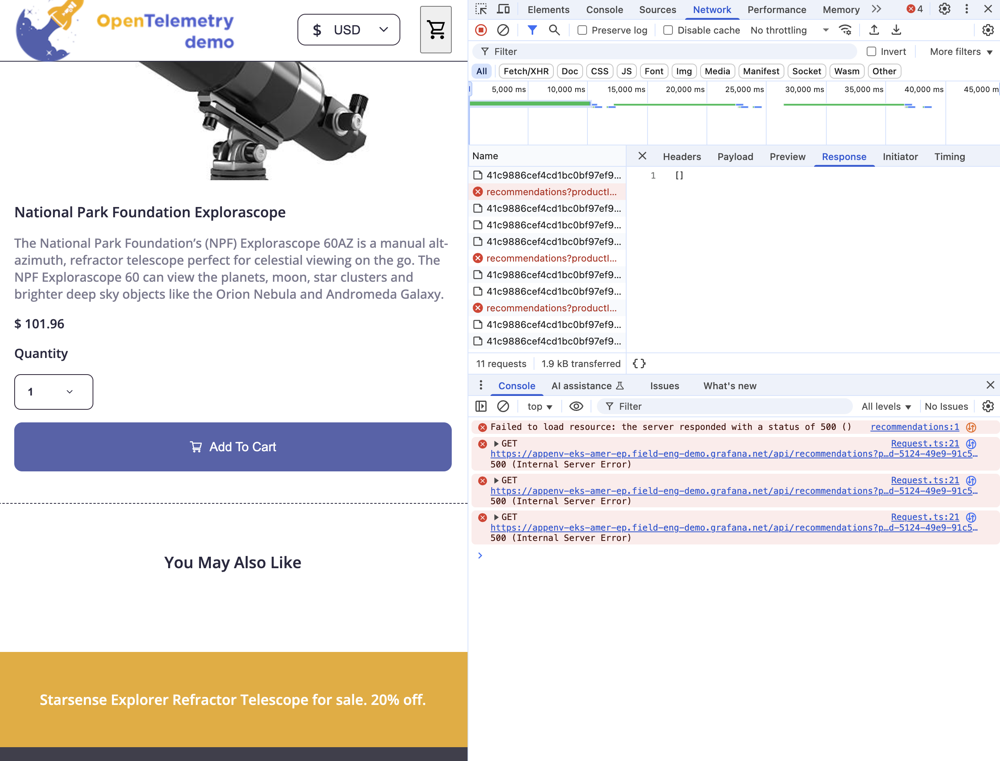
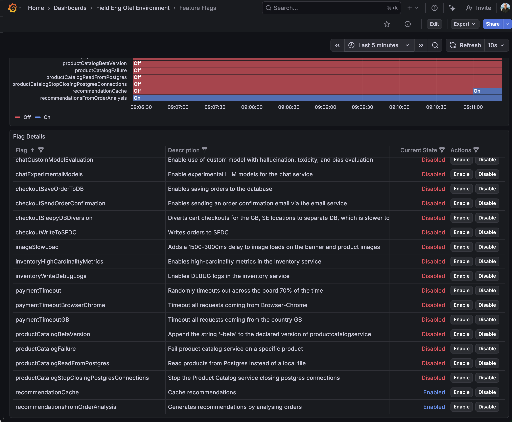

# Cloud Solutions Workshop

This repository contains follow-along workshop instructions for the Cloud Solutions Workshop, demonstrating production troubleshooting scenarios using Grafana Cloud. 

The key starting point is the recommendations visible on the product page of the Telescope e-commerce website. The recommendations are not loading due to a backend issue, which will be investigated through the personas outlined below.

## Prerequisites

Before starting the workshop, ensure the `recommendationCache` feature flag is toggled. This can be done by navigating to the Feature Flags dashboard in your Grafana Cloud instance and enabling the `recommendationCache` flag (you might need to scroll down in the table panel). The dashboard is located in the "Field Eng Otel Environment" folder. **After enabling the flag, it can take up to 10 minutes for the demo scenarios to function correctly.**

To generate user sessions for investigation as the Frontend Engineer, open the demo application in your browser and navigate to a page such as "National Park Foundation Explorascope." This will trigger the recommendations issue, providing additional real user data and errors for troubleshooting during the workshop.

## Workshop Personas

The workshop covers three different personas, each demonstrating a unique approach to investigating and resolving production issues:

### 1. [Frontend Engineer](./frontend-engineer-persona.md)
Learn how frontend engineers use Grafana Cloud Frontend Observability to:
- Investigate alerts and error spikes
- Analyze user sessions and identify affected pages
- Trace errors to upstream services
- Escalate issues using the service catalog

### 2. [SRE/Service Owner](./sre-service-owner-persona.md)
Discover how SREs respond to escalations using the RCA Workbench to:
- Analyze root causes with visual outlier detection
- Investigate pod-level metrics and crashes
- Use CPU profiling and flame graphs with AI assistance
- Implement immediate fixes and long-term resolutions

### 3. [Onboarding Engineer](./onboarding-engineer-persona.md)
Explore how onboarding engineers leverage AI-powered investigation to:
- Use the Grafana Assistant for automated analysis
- Understand investigation workflows and profiling
- Learn through both guided demos and hands-on practice
- Review and interpret investigation results

## Getting Started

Each persona guide provides step-by-step instructions for the workshop scenario. Follow along with your assigned persona or explore all three to gain a comprehensive understanding of the troubleshooting workflow.