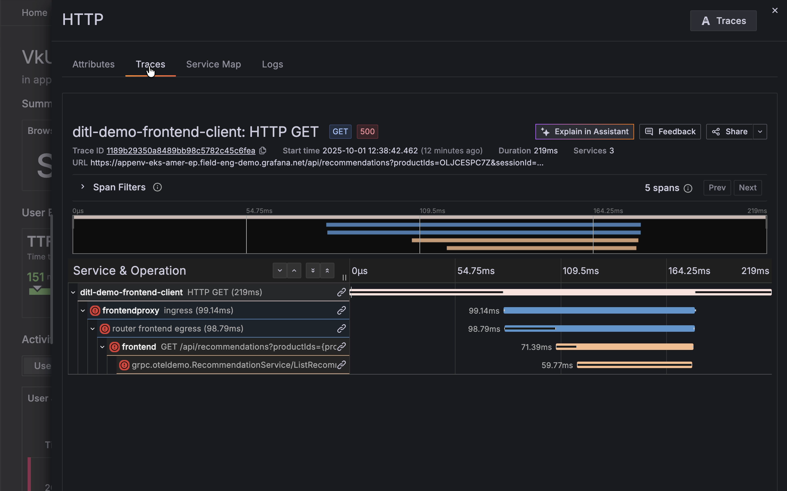

# Frontend Engineer Persona - Troubleshooting with Grafana Cloud

## Scenario: Investigating Production Errors

### Step 1: Check Frontend Observability Dashboard
**Alert triggered → jump into the frontend dashboard.**

We receive an alert indicating issues with the frontend application. Navigate to Grafana Cloud Frontend Observability to begin investigation.

### Step 2: Error Spike Detected
**Breakdown highlights specific pages impacted.**

In the main overview, we observe increased errors affecting the application. 

Looking at the page performance panel view to see a breakdown of which pages are affected. We discover that only certain pages are experiencing issues.

### Step 3: Product View
**Critical failure state clearly visible.**

Let's navigate to the product page where errors are concentrated. Click on the row in the Page Performance panel that has '/product/*' in the first column. The product page shows only errors - a critical situation requiring immediate attention.

### Step 4: User Session Replay
**Multiple API recommendation errors identified.**

Select an individual user session to see the complete details of that user's journey and understand their experience. Within the user session, we find multiple errors related to the API recommendation endpoint.

### Step 5: Trace Analysis
**Drill in to see error originates from the recommendation service.**

Click on the HTTP request and navigate to traces. The distributed trace reveals the full request path. The trace shows the error originating from the recommendation service. The span details contain the specific error message.

### Step 6: Service Catalog Lookup
**Escalate to on-call team with trace context.**

We are not the owner of the recommendation system, but it's impacting our frontend application. Look up the recommendation service in the service catalog to find the on-call team. Share the conversation from the assistant trace explanation with the recommendation service team to help them quickly understand and resolve the issue.

