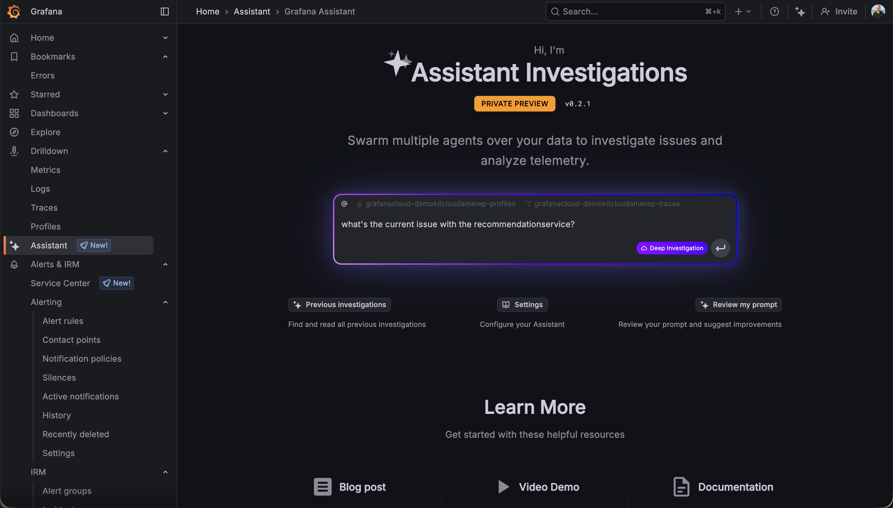
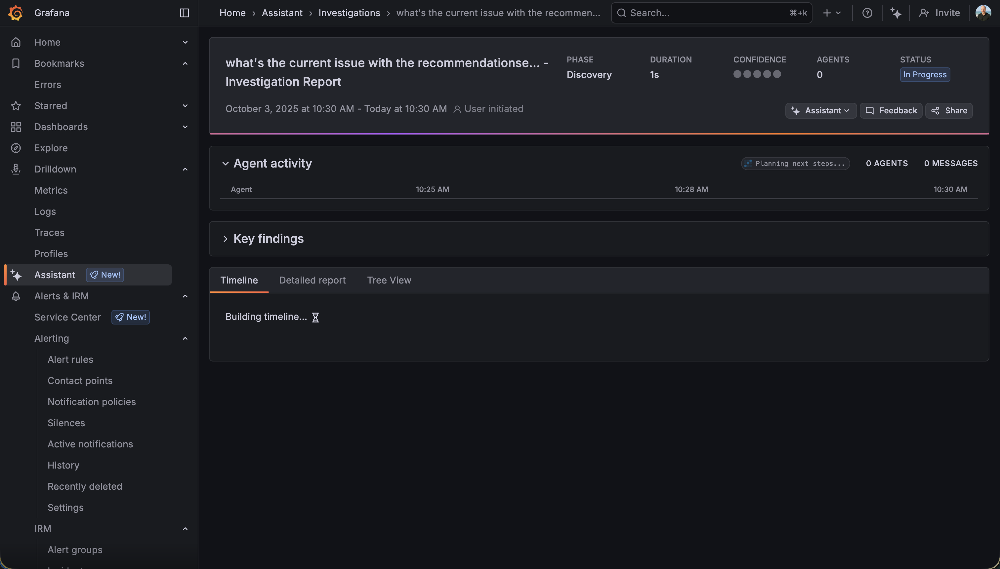
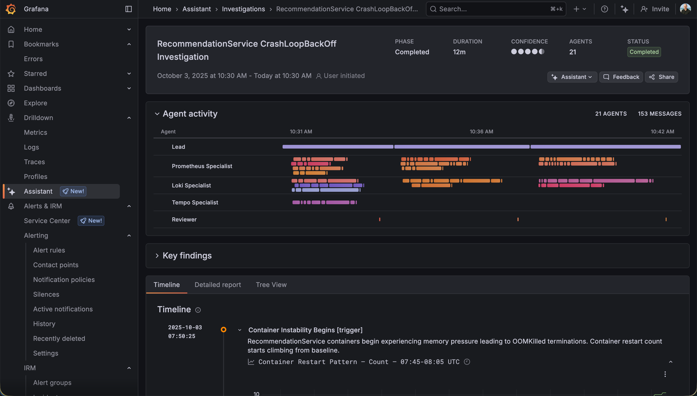
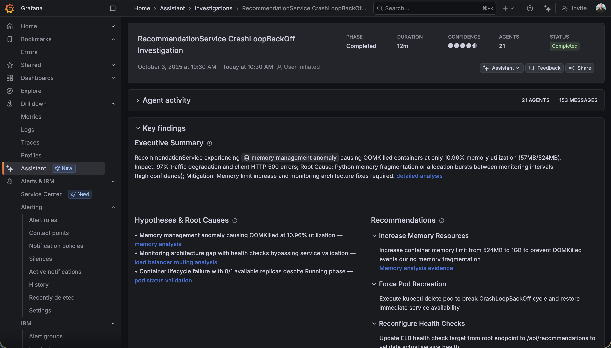

# Onboarding Engineer Persona - LLM-Powered Investigation with Grafana Cloud

## Scenario: Learning Through AI-Assisted Investigation

### Context
This persona demonstrates how onboarding engineers can leverage AI assistance to investigate production issues. The scenario covers frontend errors and alerts on the recommendation service from the "day in the life" demo production environment.

### Two Different Workflows
1. **Guided Demo**: Follow along with the presenter's investigation
2. **Hands-On Practice**: You will navigate to the assistant and ask questions yourself

### Step 1: Navigate to Assistant for LLM-Powered Investigation
**Kick off automated investigation with the LLM agent.**

From the alert view, navigate to the Grafana Assistant. This AI-powered tool can help investigate issues even if you're unfamiliar with the service or infrastructure.

You will have the opportunity to interact with the assistant yourself, asking questions about the alerts and errors.

### Step 2: Investigation Path

From the Assistant text box, make sure 'deep investigation' is toggled. Use the following prompt:

```
what's the current issue with the recommendationservice?
```

The assistant will automatically begin an investigation to identify the root cause.

The investigation workflow leverages the available observability data to narrow down the issue.



### Step 3: Investigation Workflow
**Automated steps executed to narrow down root cause.**



**Background Workflow:**
The assistant executes several automated steps behind the scenes:
- Analyzes alert context and recent changes
- Examines service metrics and logs
- Reviews CPU and memory metrics
- Correlates data across multiple signals
- Identifies anomalies and outliers



### Step 4: Walkthrough
**Review pre-recorded investigation + manually analyze results.**

**Pre-Recorded Flow:**
- Watch a pre-recorded demonstration of the complete investigation flow
- See how the assistant navigates through the problem systematically

**Manual Analysis:**
- Go through the investigation results step by step
- Review the assistant's findings and recommendations
- Understand how the AI arrived at its conclusions
- Learn what data sources were consulted and why



This approach helps you understand both the automated investigation capabilities and the manual analysis techniques you can apply to future incidents.
