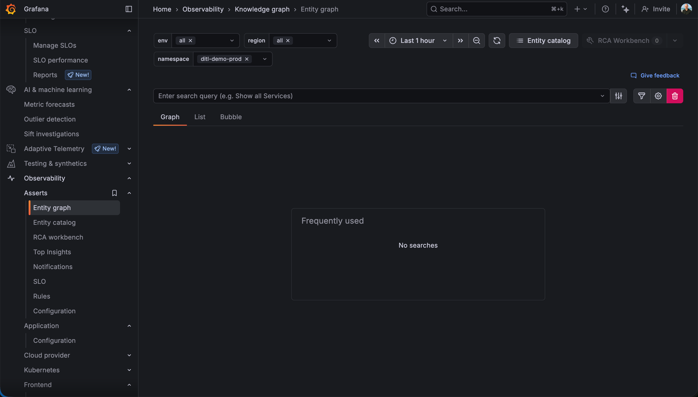
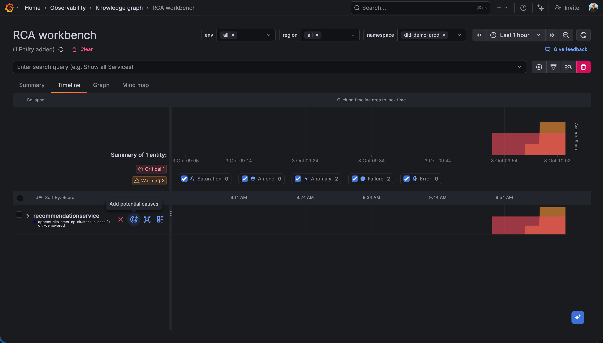
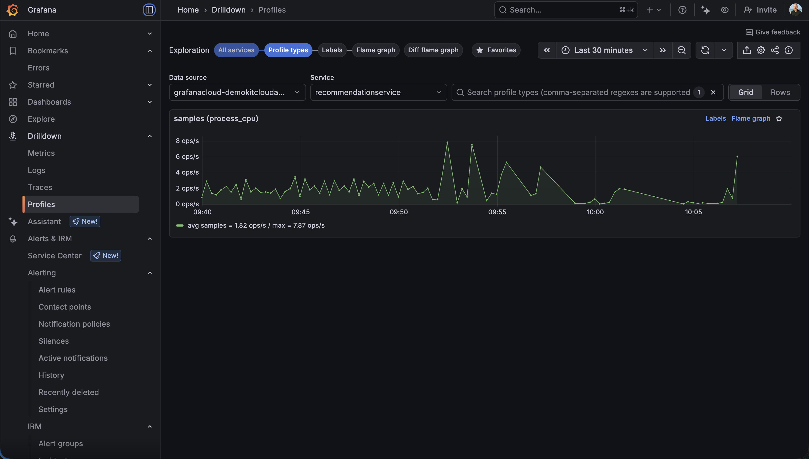

# SRE/Service Owner Persona - Root Cause Analysis with Grafana Cloud

## Scenario: Responding to Service Escalation

### Context
You don't know anything about the recommendation service, but you've received an escalation from the frontend team reporting errors. Multiple alerts are also firing for this service.

### Step 1: Open RCA Workbench
**Escalation received, alerts triggered → kick off root cause analysis.**

Receive the escalation from the frontend team about recommendation service errors. Navigate through the recommendation alert to access the RCA (Root Cause Analysis) Workbench.

Insights displays rings representing different layers of your infrastructure and services
Each ring shows the health and status of components at that layer
This visualization helps quickly identify where problems originate

### Step 2: RCA Analysis
**Spot the outlier POD showing OOM restarts/crash loops.**

**Identify Outliers:**
- The RCA Workbench highlights outliers - components behaving differently from their peers
- These outliers are often the root cause of incidents

Add the outlier POD to your investigation and examine its KPIs (Key Performance Indicators):
- Observe OOM (Out Of Memory) restarts in the pod metrics
- Identify crash loop pattern - the pod is continuously restarting due to memory issues

### Step 3: CPU Profiling
**Using Drilldown Profiles, dive into flame graph with AI assistance to pinpoint the culprit.**

Find CPU profiles for the recommendation service using `process/cpu/samples` metrics.

**Analyze Profile Types:**
- Start with drilldown profile types for the service
- View the flame graph visualization

**Understanding the Flame Graph:**
- Use AI assistance to explain the flame graph, as it's unclear what's happening
- The flame graph shows which functions are consuming the most CPU time
- After the flame graph explanation, ask the AI to also explain the OOM kills with the following prompt: "using the flamegraph CPU info only, what part of my code can cause OOM's"

The analysis reveals the specific code path or function causing excessive memory consumption.

### Step 4: Resolution
**Restart with more memory + log GitHub issue for long-term fix.**

**Immediate Fix:**
- Restart the recommendation service with increased memory allocation
- This resolves the immediate production issue

**Long-term Fix:**
- File a GitHub issue for the development team to investigate and fix the underlying memory leak or inefficient code
- Include all relevant details: flame graph, OOM patterns, and AI analysis from the RCA workbench
